# Concurrency and distribution validation report

Date: 2026-09-02  
Base revision: `ad20c0ee2c3019174c9fd1f3a770a689538597eb`; validation fixes are in the working tree  
Environment: macOS 26.5.1, Rust 1.92.0, Python 3.14.6, Docker 28.0.4, local MinIO

## Executive conclusion

The journal and process-owner fencing mechanisms are credible within the failure model exercised here. Unit tests, repeated conditional-write races, and six successful end-to-end MinIO chaos runs support these properties:

- a conditional journal-head update admits only one competing owner;
- ambiguous successful writes are resolved by reading the committed head;
- stale process completions are rejected after ownership changes;
- acknowledged process state survives owner death, loss of local state, checkpoint restore, and journal replay;
- a stable event identity deduplicates retry after an uncertain ingestion response;
- missing or corrupt committed journal/checkpoint content fails closed.

The originally documented remote-owner checkpoint barrier was not implemented end to end and its epoch-only acknowledgement shape could not establish cut consistency. That protocol has been removed from the active path. Checkpoints now explicitly use the mechanism the recovery code implements: any node synchronizes all authoritative journal tails, snapshots the resulting full-state vector cut, uploads it, and conditionally publishes it. Legacy remote acknowledgements fail closed.

A new two-node MinIO test completed work on node A, checkpointed it from standby node B while A remained the owner, killed both nodes, deleted B's local state, and restored A's committed state on B. This test also exposed and led to a fix for a control-shard CAS race when recording compatibility checkpoint metadata.

The sleep-based elasticity test was made state-driven and diagnostic. The repaired worker-loss scenario passed 10/10 isolated repetitions. This improves evidence but is not a formal liveness proof.

The execution lifecycle was subsequently repaired end to end. Direct and stream-fed execution are now mutually exclusive journal modes; every admitted event has a durable terminal-outcome record; returned failures and lost leases consume the same bounded attempt budget; and process emissions use an idempotent pending-marker handoff into the leased outbox. Pending output markers remain immutable so a cross-shard checkpoint cut cannot lose an effect. An acknowledged output and its terminal outcome survived two-node object-store-only restore.

After the initial empirical review, an executable TLA+ ownership model was added and checked with TLC. The protected model preserved its invariants across 102,526 distinct states in the extended bound. Mutation configurations produced concrete stale-owner and duplicate-completion counterexamples when their corresponding protections were disabled. This is formal evidence about the abstract model; no implementation-refinement mapping has yet been established.

Recommended claim boundary:

> The current evidence supports conditionally serialized journal appends, stale-owner fencing, and full-state journal-vector recovery checkpointed by a non-owner node. Partition-local checkpoint handles and globally aligned multi-input barriers remain future protocols and are not claimed.

## End-to-end execution flow

[Open the rendered SVG](./EXECUTION_FLOW.svg).

The diagram follows a logical event from admission through its one durable terminal
outcome. Dashed lines are recovery dependencies rather than normal request flow.

```mermaid
flowchart TB
    producer["Producer / SDK<br/>stable process + key + event ID"]
    mode{"Configured ingress mode"}

    subgraph ingress["Admission — exactly one mode per process key"]
        direction LR
        direct["Direct ingress<br/>route by process key"]
        stream["StreamWriter<br/>fenced source epoch + durable offset"]
        control["Control stream change"]
        task["Workflow task<br/>route by process key"]
        admit["Atomic shard admission<br/>mailbox + dedup + PENDING outcome"]
        direct --> admit
        stream --> control --> task --> admit
    end

    subgraph authority["Authoritative durable state"]
        direction LR
        journal["Immutable per-shard journal record"]
        head["Conditional journal-head CAS<br/>linearization point"]
        rocks["Local RocksDB view<br/>rebuildable cache"]
        journal --> head
        journal --> rocks
    end

    subgraph execution["Fenced, at-least-once invocation"]
        direction TB
        owner["Partition owner<br/>durable owner epoch"]
        grant["Activation grant<br/>lease token + epoch + sequence"]
        worker["Worker sandbox invokes handler"]
        result{"Handler result"}
        validate{"Token, epoch, sequence,<br/>and current owner valid?"}
        expired["Lease expires"]
        stale["Reject stale completion<br/>no state transition"]
        failure["Durably increment attempt"]
        budget{"Attempt budget exhausted?"}
        retry["Isolated retry lane<br/>preserve key ordering"]
        quarantine["Atomic terminal failure<br/>FAILED + quarantine + release key"]
        commit["Atomic successful completion<br/>state + COMMITTED outcome +<br/>pending effects + release lease"]

        owner --> grant --> worker --> result
        grant -. no completion .-> expired
        result -- success --> validate
        validate -- no --> stale
        stale -. pending event remains under current owner .-> owner
        validate -- yes --> commit
        result -- returned failure --> failure
        expired --> failure
        failure --> budget
        budget -- no --> retry --> grant
        budget -- yes --> quarantine
    end

    subgraph delivery["Recoverable output handoff"]
        direction LR
        marker["Immutable pending-effect marker<br/>on execution shard"]
        promote["Idempotent promoter<br/>deterministic message ID"]
        outbox["Control-shard leased outbox"]
        sink["Sink delivery<br/>destination deduplicates message ID"]
        ack["Durable acknowledgement"]
        marker --> promote --> outbox --> sink --> ack
    end

    subgraph recovery["Checkpoint and recovery plane"]
        direction LR
        sync["Synchronize every authoritative<br/>journal tail"]
        snapshot["Snapshot full state<br/>with exact shard-position vector"]
        upload["Upload content-addressed files"]
        pointer["Conditionally publish<br/>current checkpoint pointer"]
        restore["Verify snapshot, restore cache,<br/>replay each journal tail"]
        resume["Reconstruct outcomes, effects,<br/>acks, and resume under new epoch"]
        sync --> snapshot --> upload --> pointer --> restore --> resume
    end

    producer --> mode
    mode -- direct --> direct
    mode -- stream-fed --> stream
    admit --> journal
    head --> owner
    rocks --> owner
    commit --> journal
    quarantine --> journal
    commit --> marker
    ack --> journal

    journal -. durable source .-> sync
    head -. covered vector .-> snapshot
    pointer -. after process or node loss .-> restore
    resume -. rebuild ownership and pending work .-> owner

    guarantee["Guarantee boundary:<br/>at-least-once handler invocation · exactly-once fenced state transition<br/>one durable terminal outcome · at-least-once output with deterministic ID"]
    commit --> guarantee
    ack --> guarantee
    quarantine --> guarantee

    classDef durable fill:#0b3b4a,color:#fff,stroke:#41c7d9,stroke-width:2px;
    classDef decision fill:#fff4cc,color:#322b00,stroke:#d7a900,stroke-width:2px;
    classDef failure fill:#4d1f2d,color:#fff,stroke:#ff7897,stroke-width:2px;
    classDef success fill:#123f2a,color:#fff,stroke:#56d995,stroke-width:2px;
    classDef note fill:#252940,color:#fff,stroke:#9da7ff,stroke-width:2px;
    class journal,head,admit,marker,outbox,ack,snapshot,pointer,restore durable;
    class mode,result,validate,budget decision;
    class stale,failure,quarantine failure;
    class commit,guarantee success;
    class producer,rocks,owner,grant,worker,retry,promote,sink,sync,upload,resume,direct,stream,control,task,expired note;
```

The boundary is intentional: handler code may run more than once. A handler must
not perform an uncoordinated non-idempotent external side effect. Effects that need
reliable execution go through the pending-marker/outbox path, and the destination
uses the deterministic message ID to suppress duplicate delivery.

## Scope and method

This validation combined:

1. The complete Rust and Python test suites.
2. Repeated high-contention execution of the journal competing-owner test.
3. Repeated two-process crash/failover/object-store-outage tests using MinIO.
4. Repeated elastic scale-out and worker-loss tests.
5. Code-level tracing of linearization points, transaction boundaries, ownership validation, checkpoint publication, and restore.
6. Exhaustive bounded TLA+ model checking of ownership, prepared completions, takeover, head CAS, epoch fencing, event deduplication, execution termination, and durable output acknowledgement.

It did not include AWS S3, host-level network partitioning, clock skew, filesystem fault injection, or deterministic implementation schedule exploration. TLA+ checking is exhaustive only within each abstract model's stated finite bounds; it is not a proof that the Rust implementation refines those models.

## Dynamic results

| Validation | Result | What it establishes |
| --- | --- | --- |
| `cargo test --workspace` | PASS: 28 tests | Journal fencing, competing writers, ambiguous writes, corruption handling, checkpoint pointer failures, ownership epochs, watermark primitives, and selected process behavior |
| `PYTHONPATH=src python3 -m unittest discover -s tests -v` | PASS: 67 run; 65 passed, 2 skipped | SDK, operator examples, ordered keyed state, terminal outcomes, bounded worker-loss failure, replay, scale-out, source cursors, and hosted boundaries; both opt-in MinIO cases skipped |
| MinIO S3 chaos suite | PASS: 2/2 | Owner failover and fencing plus non-owner checkpoint publication and object-store-only restore |
| Repeated MinIO S3 chaos test | PASS: 5/5 additional runs | Repeatability of the preceding scripted failure history |
| Competing journal owners | PASS: 200/200 repeated runs | Repeatability of conditional-head exclusion under the in-memory object-store test implementation |
| TLA+ protected ownership model, small bound | PASS: 1,208 distinct states, depth 9 | No stale completion, duplicate completion, head/log divergence, type error, or owner-epoch regression in the bounded abstract model |
| TLA+ protected ownership model, extended bound | PASS: 102,526 distinct states; 360,742 states generated; depth 13 | Exhaustive bounded exploration with two nodes, two events, two tokens, three generations, and bounded activations/log length |
| TLA+ fencing mutation | EXPECTED COUNTEREXAMPLE: 5 states | Without CAS and epoch fencing, a prepared old-owner completion commits after takeover |
| TLA+ dedup mutation | EXPECTED COUNTEREXAMPLE: 7 states | Without durable event deduplication, two activations commit the same event |
| TLA+ checkpoint bound protocol | PASS: 189 distinct states; 382 states generated; depth 9 | Handles explicitly bound to the barrier vector remain cut-consistent |
| TLA+ checkpoint epoch-only protocol | COUNTEREXAMPLE: 6 states | Current ownership alone permits publication of handles representing a different cut from the barrier |
| TLA+ implemented journal-vector checkpoint | PASS: 1,295 distinct states; 15,595 states generated; depth 11 | Snapshot state matches its vector, published history covers cleanup, and snapshot-plus-tail recovery equals authoritative heads |
| TLA+ unsafe checkpoint cleanup | EXPECTED COUNTEREXAMPLE: 3 states | Truncating before publication loses the recoverability invariant |
| TLA+ unsafe pointer regression | EXPECTED COUNTEREXAMPLE: 7 states | Publishing an older vector after cleanup makes retained history inconsistent with the current checkpoint |
| TLA+ execution lifecycle | PASS: 17 distinct states; 19 states generated; depth 9 | Under weak fairness, bounded handler/lease failures terminate and committed pending output is promoted and acknowledged |
| TLA+ uncounted lease-loss mutation | EXPECTED LIVENESS COUNTEREXAMPLE: 17 distinct states | Repeated grant/loss cycles can keep an execution pending forever when lease loss does not consume attempts |
| TLA+ premature output-marker cleanup | EXPECTED COUNTEREXAMPLE: 5 distinct states | Removing the source marker violates the handoff model's retained-source invariant |
| Non-owner checkpoint/restore chaos | PASS | Standby checkpointed remote-owner state; both nodes died; standby local state was deleted; object checkpoint plus journal restored exact state |
| Repaired elastic worker-loss test | PASS: 10/10 repetitions | State-driven scale-out, worker replacement, exact 4,000 completions, and final per-key state |

The first Python command without `PYTHONPATH=src` failed import discovery. It was rerun with the repository's documented/release configuration and passed; the initial result is an invocation error, not a product failure.

## TLA+ ownership model

The executable model is in `formal/tla/JournalOwnership.tla`. It represents:

- a conditionally advanced partition journal head;
- durable owner-generation records;
- activation grants carrying owner epoch and activation number;
- completion preparation against an observed head;
- takeover between preparation and commit;
- retries of the same logical event;
- CAS fencing, epoch fencing, and durable event deduplication.

Checked invariants:

- `TypeOK`: every state remains in its declared finite domain;
- `HeadMatchesLog`: the journal head version equals committed log length;
- `NoStaleCompletions`: no completion is older than an owner generation already committed before it;
- `NoDuplicateCompletions`: a logical event appears in at most one completion record;
- `OwnerEpochMonotonic`: committed owner generations strictly increase.

The extended configuration used two nodes, two events, two reusable activation tokens, three owner epochs, four activation numbers, and seven log positions. TLC completed breadth-first exploration with zero states left in the queue. The optimistic fingerprint-collision estimate was `1.4e-9` and the estimate based on actual fingerprints was `5.3e-10`.

Mutation testing matters here. Disabling both head CAS and epoch fencing yielded this minimal counterexample:

1. Node 2 owns epoch 1.
2. Node 2 grants and prepares event 1 against head 1.
3. Node 1 takes over and commits epoch 2 at head 2.
4. Node 2's epoch-1 completion commits at head 3.

Disabling deduplication yielded a separate trace in which two activation tokens sequentially committed event 1 in the same epoch.

Limitations:

- This is a bounded safety model, not an unbounded mathematical proof.
- Expected terminal states are allowed; liveness and fairness are not specified yet.
- The CAS and completion are abstract actions. There is no mechanically checked refinement from Rust functions and object-store calls to those actions.
- The ownership model does not yet include object-store ambiguity/readback, control-shard interactions, operator edges, or watermarks. Lease loss and execution termination are modeled separately in `ExecutionLifecycle.tla`.
- The model initially had an unbounded activation counter; that run was stopped after more than 21 million distinct states. The final model explicitly bounds activations and completed exhaustively.

### TLA+ checkpoint result

`formal/tla/CheckpointBarrier.tla` separately models a barrier's partition-position vector, concurrent journal progress, acknowledged state-handle cuts, and publication.

The desired configuration requires every handle cut to equal the barrier vector. TLC exhausted 189 distinct states without violating `PublishedHandlesMatchBarrier`.

The epoch-only configuration removes that binding, corresponding to an acknowledgement that proves current ownership but carries no covered journal positions. TLC found this six-state counterexample:

1. Partition 1 advances to position 1; partition 2 remains at 0.
2. The coordinator starts a barrier for vector `(1, 0)`.
3. Node 1 acknowledges a handle for cut `(0, 0)`.
4. Node 2 acknowledges a handle for cut `(0, 0)`.
5. All expected nodes have acknowledged, so the coordinator publishes.
6. The published handles do not represent the barrier vector.

This counterexample does not require stale ownership. It demonstrates that epoch equality and node membership cannot establish checkpoint-cut equality. The remote-handle protocol was consequently removed from the active path: new compatibility barriers publish a full-state journal-vector checkpoint immediately, and legacy acknowledgement requests are rejected.

`formal/tla/JournalVectorCheckpoint.tla` models the replacement protocol. The protected configuration exhausted 1,295 distinct states. Its cleanup mutation found deletion before publication in three states, and its pointer-regression mutation found publication of an older cut after cleanup in seven states.

## Guarantee assessment

### Journal linearization and fencing: strong evidence

`ConditionalJournal::append` uploads an immutable record and then conditionally updates the partition head. The head CAS is the linearization point. On an ambiguous error it rereads the head and accepts success only if the observed head is the exact proposed value. A losing candidate object is best-effort deleted.

Recovery walks the committed parent chain, verifies partition and position, and rejects invalid or missing records. Epochs must be nonzero, monotonic, and may advance by at most one generation.

Evidence:

- `crates/server/src/journal.rs`, `append`, lines 530-621.
- `crates/server/src/journal.rs`, `recover`, lines 624-671.
- Tests for stale owners, competing owners, skipped generations, ambiguous responses, corrupt records, and missing records all passed.
- The competing-owner test passed 200 repeated executions.

Residual risk:

- The high-contention test uses the in-memory `object_store` implementation, not AWS S3.
- Only a small competing history is repeatedly sampled; there is no generated multi-client history checker.
- Network delay, duplicated requests, and asymmetric partitions are not independently controlled.

### Process completion atomicity and stale-work rejection: good evidence

Completion validates the lease token, shard, owner epoch, activation sequence, current durable owner, and batch cardinality inside the shard transaction. State, terminal outcome, pending output effects, and lease release are accumulated in one transaction and serialized as one shard WAL record.

The chaos test captured an activation, killed its owner, waited for a higher epoch, and verified that delayed completion was rejected. The recovered activation then committed once and survived complete local-state deletion.

Evidence:

- `crates/server/src/process.rs`, `complete_process_partition`, lines 1568 onward.
- `crates/server/src/storage.rs`, `commit_shard`, lines 301-370.
- `tests/test_s3_chaos.py`, owner crash and stale completion, lines 334-435.
- Six total successful executions of the complete chaos scenario during this validation.

Residual risk:

- The chaos workload uses batch size one and two business events.
- The original failover case does not emit output, but the non-owner checkpoint case now commits, leases, and acknowledges a process output and proves after object-store-only restore that it is not redelivered.
- It does not kill the process at every instruction-level boundary within completion.

### Execution termination and output delivery: good bounded evidence

Every newly admitted process event records a `PENDING` outcome in the same shard transaction as admission. Successful completion changes it to `COMMITTED`; exhausted returned failures or lost activation leases change it to `FAILED`. Both direct partition activations and stream-fed workflow activations now apply the same `max_attempts` boundary. Direct ingress requires a stable event ID scoped to the process key and rejects content-changing reuse.

An emitted effect first becomes an immutable pending marker in the completion shard. Promotion to the leased control-shard outbox is deterministic and idempotent. The source marker is deliberately retained until a future checkpoint-vector-covered garbage collector exists; TLC's cleanup mutation verifies that the current handoff model depends on that retention. The MinIO test proved an acknowledged message remained acknowledged after checkpoint restore and complete local-state loss.

The remaining semantic boundary is unavoidable: handler invocation is at least once. Non-idempotent external effects performed directly inside handler code are outside the guarantee; reliable effects must use the emitted outbox message ID at an idempotent destination.

### Local checkpoint publication and restore: good evidence

Local checkpoint preparation synchronizes journal tails, holds the per-shard sequence guards while flushing and snapshotting RocksDB, and records a vector of shard positions. Publication uploads content-addressed files before conditionally replacing `current.json`. Local WAL cleanup follows publication.

Restore validates checkpoint file sizes and SHA-256 digests. Tests for interrupted publication, ambiguous pointer response, monotonic publication, content reuse, and corruption all passed. The chaos scenario demonstrated restore after deleting all local state.

Evidence:

- `crates/server/src/storage.rs`, `prepare_checkpoint` and `publish_checkpoint`, lines 439-519.
- `crates/server/src/journal.rs`, remote restore, lines 346-408.
- `crates/server/src/journal.rs`, remote publication, lines 410-509.

The new chaos test establishes that the publishing node need not own the process partition: synchronizing the shared journal first brought the remote owner's committed transition into the standby's snapshot, and object-store-only recovery reproduced it after both nodes and the standby's local directory were removed.

### Remote-handle barrier: removed from the active protocol

The initial review found that the documented remote-owner protocol could not establish its claimed property:

1. `AcknowledgeCheckpointRequest` contains only `state_handle` and `key_group_epochs`; it contains no per-shard journal positions, checkpoint digest, or barrier cut.
2. The coordinator prepares its local checkpoint before collecting remote acknowledgements, then validates only that the remote node still owns the expected key-group epochs.
3. Searches found SDK methods for manually listing and acknowledging barriers, but no service-side agent that prepares a remote snapshot and submits the acknowledgement.
4. `CheckpointManifest.state_handles` is written and displayed by the console, but no restore path reads it.
5. Remote checkpoint publication uploads files only from the coordinator's local `source` directory. Restore iterates that `files` list and does not fetch remote state handles.
6. The original S3 chaos test checkpointed only after failover had left one active owner; it did not exercise checkpoint publication from a non-owner node.

Evidence:

- `crates/server/src/model.rs`, checkpoint acknowledgement types, lines 656-680.
- `crates/server/src/maintenance.rs`, barrier creation and acknowledgement, lines 150-314.
- `crates/server/src/journal.rs`, checkpoint upload and restore, lines 363-465.
- Repository-wide references to `state_handles` are limited to model/storage population and console presentation.

Resolution:

- ordinary checkpoints are allowed from nodes that do not own active partitions;
- checkpoint creation synchronizes all authoritative journal shards and records the exact snapshot vector;
- the compatibility barrier endpoint immediately publishes that vector checkpoint with no remote handles;
- legacy acknowledgement calls are rejected;
- documentation now describes the journal-vector protocol actually restored by the service;
- a non-owner checkpoint and object-store-only restore is covered by the MinIO chaos suite.

Partition-local handles and aligned multi-input barriers remain future work and are not represented as implemented guarantees.

### Elasticity and liveness: improved, still empirical

The normal suite passed once, including scale-out and worker-loss recovery. Under repetition:

- one stressed run failed to drain 4,000 transitions within 30 seconds after worker cancellation and replacement;
- a standalone run failed earlier because the workload completed before the hard-coded 40 ms backlog sample, producing a one-replica recommendation instead of the asserted four.

The fixed-delay synchronization was replaced with polling until the live workload actually produces the expected scaling decision. Worker and publisher cleanup now runs in `finally`, and drain failures include process state, partition owners, epochs, and worker exceptions. The repaired scenario passed 10/10 isolated repetitions.

The earlier stressed drain timeout has not been reproduced with the repaired test. Hundreds of seeded runs and progress-over-lease-period assertions are still needed before assigning high liveness confidence.

### Event time and incremental operators: unit/integration evidence only

Tests cover monotonic partition watermarks, minimum active-partition aggregation, idleness, allowed lateness, temporal lookup behavior, interval joins, deduplication, windows, and native operator examples. These passed.

Not tested under distribution or recovery:

- watermark advancement racing source-owner takeover;
- idle/reactivated partitions across restore;
- operator pending-edge forwarding interrupted at every boundary;
- multi-input barrier alignment;
- retractions and corrections across owner failure;
- finalization invariants under delayed and reordered messages.

These guarantees should remain below the confidence assigned to journal fencing.

## CI and operational observations

The release-readiness workflow contains the right baseline commands, including the MinIO chaos test, but it is triggered only by `workflow_dispatch`. Consequently, no automatic pull-request or main-branch gate continuously protects these properties.

Recommended split:

- Every pull request: Rust/Python suites, deterministic fault tests, generated histories with persisted seeds.
- Nightly: repeated MinIO chaos, worker-loss/rebalance stress, fault-injected checkpoint tests.
- Scheduled against AWS S3: conditional-write contention and ambiguous-response recovery.
- Release: multi-hour continuous workload with node kills, local-state deletion, checkpoint/restore, and a reference-state comparison.

## Priority actions

### P1 — connect the formal model to implementation and deterministic tests

The initial TLA+ ownership and checkpoint-cut models are now present. Define a refinement mapping from the Rust journal, process-owner, lease, and checkpoint structures to their TLA+ variables. For each abstract action, identify the exact implementation linearization point and add trace assertions that emit model-comparable histories.

Create a pure executable reference state machine for journal heads, epochs, inboxes, leases, state, output, source cursors, watermarks, and checkpoint vectors. Add controllable object-store, clock, and crash hooks, then generate small implementation histories with `proptest`. Persist and replay failing seeds against both the reference model and Rust implementation.

Extend the TLA+ work to ambiguous object-store responses, control-shard contention, and eventual ownership takeover after a failed owner stops interfering. Lease loss, bounded termination, output promotion, and acknowledgement are now covered by the weak-fairness execution model. All models still need an implementation refinement mapping.

### P1 — continue strengthening liveness tests

The sleep-based coordination and missing diagnostics are fixed. Direct and stream-fed crash loops now each prove two lost leases reach durable terminal failure. Next, use deterministic virtual time and generated failure histories rather than relying on wall-clock expiry.

### P2 — broaden chaos coverage

Use multiple keys and partitions, batch sizes greater than one, repeated output promotion/acknowledgement crashes, network delay/partition, clock skew, rolling upgrades, multi-input operators, and a continuously checked reference ledger.

### P2 — make validation continuous

Run the fast safety suite on every change, nightly chaos automatically, and real-S3 conditional-write tests on a schedule.

## Final assessment

| Area | Confidence | Release assessment |
| --- | --- | --- |
| Journal CAS and recovery chain | High for tested backend/history | Suitable for continued development and controlled deployment testing |
| Process-owner fencing | High for scripted failover | Strong design with successful end-to-end evidence |
| Per-shard atomic completion | Moderate-high | Terminal outcome and pending effects share the fenced commit; broaden instruction-level crash tests |
| Execution termination and output | Moderate-high | Direct and stream modes have bounded terminal failure; acknowledged output survived object-store-only restore |
| Journal-vector checkpoint/restore | Moderate-high | Modeled and demonstrated from a non-owner node with object-store-only recovery |
| Remote partition-local/aligned checkpoints | Not implemented | Explicit future work; no current guarantee |
| Elastic liveness | Moderate | Repaired test passed 10/10; deterministic time and longer stress remain |
| Distributed event-time/operators | Low-moderate | Functional coverage exists, distributed failure coverage does not |

No data-safety counterexample was observed in the protected journal, stale-owner, or journal-vector checkpoint paths tested and modeled. The remote-handle mismatch found by review and TLA+ was resolved by removing that protocol from the active path and documenting/testing the full-state vector mechanism actually used for restore.
